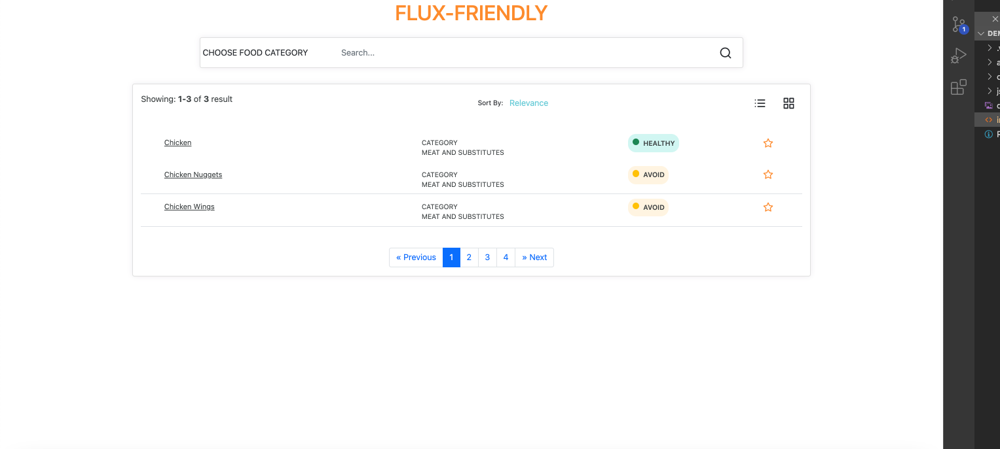

# 🎰 MY DEMO-DAY PROJECT: GERD-K

### Goal: Build a simple app that allows users to look up food items/categories that may or may not affect their acid reflux symptoms

For those who suffer from GERD or Acid Reflux, finding the right food to eat on a daily basis can be a daunting task as each individual experiences their reflux symptoms differently. 

To help mitigate this issue, I built this app as a reference guide for new GERD patients in order to help them plan out their diet.

</img>

Link to live site: [https://danielmtran-demo-day.netlify.app]

